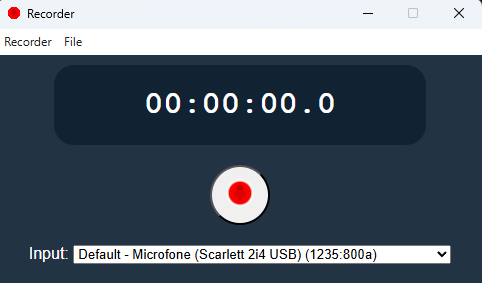
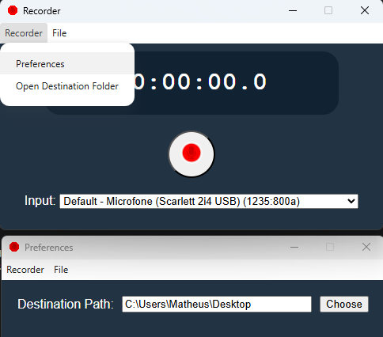

# 🎙️ Electron Audio Recorder

Aplicação desktop para **gravação de áudio**, desenvolvida com **Electron, JavaScript, HTML e CSS**, com integração entre o processo Renderer e o processo Main através de **IPC (Inter-Process Communication)**.

O projeto foi desenvolvido com foco em compreender na prática o funcionamento do Electron, incluindo **captura de áudio pelo navegador, comunicação segura entre processos, manipulação de arquivos pelo Node.js e geração de uma aplicação desktop distribuível**.

---

## 📸 Preview

<p align="center">
  
</p>
<p align="center">
  
</p>


---

## 🚀 Sobre o projeto

O **Electron Audio Recorder** permite que o usuário utilize o microfone do computador para realizar gravações de áudio diretamente através de uma aplicação desktop.

A aplicação utiliza a API **MediaRecorder** para capturar o áudio e, após a gravação, envia os dados para o processo principal do Electron através de **IPC**.

O processo principal é responsável por receber o conteúdo da gravação e utilizar os recursos do **Node.js** para salvar o arquivo `.webm` no computador.

### Fluxo da aplicação

```text
┌─────────────────────────┐
│        Usuário          │
│                         │
│   Inicia a gravação     │
└────────────┬────────────┘
             │
             ▼
┌─────────────────────────┐
│      Renderer Process   │
│                         │
│      MediaRecorder      │
│          ↓              │
│      Captura áudio      │
└────────────┬────────────┘
             │
             │ IPC
             ▼
┌─────────────────────────┐
│       Main Process      │
│                         │
│       ipcMain           │
│          ↓              │
│      Node.js / FS       │
└────────────┬────────────┘
             │
             ▼
┌─────────────────────────┐
│       Arquivo .webm     │
│                         │
│    Salvo no computador  │
└─────────────────────────┘
```

---

## ✨ Funcionalidades

* 🎙️ Captura de áudio através do microfone
* ⏺️ Início e encerramento da gravação
* ⏱️ Controle do tempo de gravação
* 🎧 Seleção de dispositivo de entrada
* 💾 Salvamento das gravações em formato `.webm`
* 🔄 Comunicação entre Renderer e Main Process
* 🔐 Comunicação utilizando `preload` e `contextBridge`
* 📁 Manipulação de arquivos utilizando Node.js
* 🖥️ Aplicação desktop multiplataforma através do Electron
* 📦 Build da aplicação para distribuição

---

## 🛠️ Tecnologias utilizadas

### Front-end

* HTML5
* CSS3
* JavaScript
* Web APIs
* MediaRecorder API

### Desktop

* Electron
* IPC
* `ipcMain`
* `ipcRenderer`
* `preload`
* `contextBridge`

### Node.js

* Node.js
* File System (`fs`)
* Path (`path`)

### Build

* Electron Builder / ferramenta de empacotamento utilizada no projeto

---

## 🧠 Conceitos aplicados

Este projeto foi desenvolvido para colocar em prática conceitos importantes do desenvolvimento de aplicações desktop modernas.

### Electron Architecture

O projeto utiliza a arquitetura baseada em processos do Electron:

```text
Main Process
     │
     ├── BrowserWindow
     ├── File System
     └── IPC
          │
          ▼
Renderer Process
     │
     ├── Interface
     ├── MediaRecorder
     └── User Interaction
```

### IPC — Inter-Process Communication

A comunicação entre os processos é feita utilizando IPC.

O Renderer envia os dados da gravação:

```javascript
window.electronAPI.saveBuffer(buffer)
```

O processo principal recebe:

```javascript
ipcMain.on("save_buffer", (event, buffer) => {
    // processamento e armazenamento
})
```

Isso permite separar responsabilidades entre a interface e as operações que precisam de acesso ao Node.js.

---

## 🔐 Segurança

O projeto utiliza uma abordagem mais segura para comunicação entre o Renderer e o processo principal.

Em vez de disponibilizar diretamente o Electron para o código da interface, o `preload.js` utiliza `contextBridge` para expor somente as funcionalidades necessárias.

Exemplo:

```javascript
contextBridge.exposeInMainWorld("electronAPI", {
    saveBuffer: (buffer) => {
        ipcRenderer.send("save_buffer", buffer)
    }
})
```

Essa abordagem evita a necessidade de habilitar diretamente:

```javascript
nodeIntegration: true
```

no Renderer.

---

## 📂 Estrutura do projeto

```text
electron-audio-recorder/
│
├── assets/
│   └── preview.png
│
├── index.html
├── renderer.js
├── preload.js
├── main.js
├── style.css
├── package.json
├── package-lock.json
│
└── ...
```

### Responsabilidade dos principais arquivos

| Arquivo        | Responsabilidade                   |
| -------------- | ---------------------------------- |
| `main.js`      | Processo principal do Electron     |
| `preload.js`   | Ponte segura entre Renderer e Main |
| `renderer.js`  | Lógica da interface e gravação     |
| `index.html`   | Estrutura da aplicação             |
| `style.css`    | Estilização da interface           |
| `package.json` | Dependências e scripts do projeto  |

---

## ⚙️ Como executar

### Pré-requisitos

É necessário possuir instalado:

* Node.js
* npm

Clone o repositório:

```bash
git clone https://github.com/SEU-USUARIO/SEU-REPOSITORIO.git
```

Entre na pasta:

```bash
cd SEU-REPOSITORIO
```

Instale as dependências:

```bash
npm install
```

Execute em ambiente de desenvolvimento:

```bash
npm start
```

---

## 📦 Build

O projeto também foi **empacotado para distribuição como aplicação desktop**, permitindo executar o programa sem precisar iniciar manualmente através do código-fonte.

Para gerar o build:

```bash
npm install --save-dev electron-builder
```

O instalador/arquivo executável será gerado na pasta de distribuição configurada pelo projeto.

> O comando pode variar de acordo com a configuração definida no `package.json`.

---

## 🎯 Objetivos do projeto

O projeto teve como principais objetivos:

* Aprender a arquitetura do Electron
* Entender a comunicação entre processos
* Trabalhar com APIs nativas do navegador
* Integrar recursos do Node.js em uma aplicação desktop
* Trabalhar com manipulação de arquivos
* Implementar comunicação segura utilizando `preload` e `contextBridge`
* Aprender o processo de build e distribuição de aplicações Electron
* Desenvolver uma aplicação desktop funcional do início ao fim

---

## 📚 Aprendizados

Durante o desenvolvimento, foram trabalhados conceitos como:

**Electron**

* Main Process
* Renderer Process
* BrowserWindow
* Preload
* IPC
* Context Isolation

**JavaScript**

* Eventos
* Promises
* APIs Web
* Manipulação de dados binários
* MediaRecorder

**Node.js**

* File System
* Path
* Buffers
* Manipulação de arquivos

**Desktop Development**

* Estrutura de aplicações Electron
* Segurança entre processos
* Empacotamento
* Build
* Distribuição

---

## 🔮 Possíveis melhorias

Algumas funcionalidades que podem ser adicionadas futuramente:

* [ ] Reprodução das gravações dentro da aplicação
* [ ] Lista de gravações anteriores
* [ ] Exclusão de gravações
* [ ] Renomeação dos arquivos
* [ ] Exportação para outros formatos
* [ ] Controle de volume de entrada
* [ ] Visualização da onda sonora
* [ ] Atalhos de teclado
* [ ] Sistema de configurações
* [ ] Tema claro/escuro
* [ ] Seleção da pasta de destino
* [ ] Histórico de gravações

---

## 💼 Por que este projeto é relevante?

Apesar de possuir uma proposta simples, o projeto demonstra conhecimentos importantes para o desenvolvimento de aplicações desktop.

A aplicação envolve desde a **interação com hardware através do microfone** até a **comunicação entre diferentes processos**, manipulação de arquivos e **empacotamento de uma aplicação real para distribuição**.

Isso torna o projeto uma demonstração prática de conhecimentos em:

```text
JavaScript
    │
    ├── Web APIs
    │
    ├── Node.js
    │
    └── Electron
          │
          ├── Main Process
          ├── Renderer Process
          ├── IPC
          ├── Preload
          └── Build
```

---

## 👨‍💻 Autor

**Matheus Spindula**

Desenvolvedor Full Stack apaixonado por tecnologia e desenvolvimento de software.

🎓 Análise e Desenvolvimento de Sistemas
📚 Engenharia de Software
💻 JavaScript • TypeScript • React • Node.js • Electron

---

## ⭐ Contribuição

Se este projeto foi útil ou interessante para você, considere deixar uma ⭐ no repositório.

Feedbacks, sugestões e contribuições são sempre bem-vindos.

---

## 📄 Licença

Este projeto está disponível sob a licença definida neste repositório.
